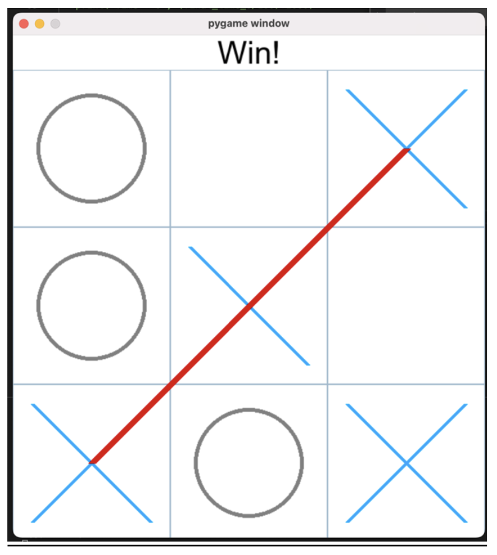
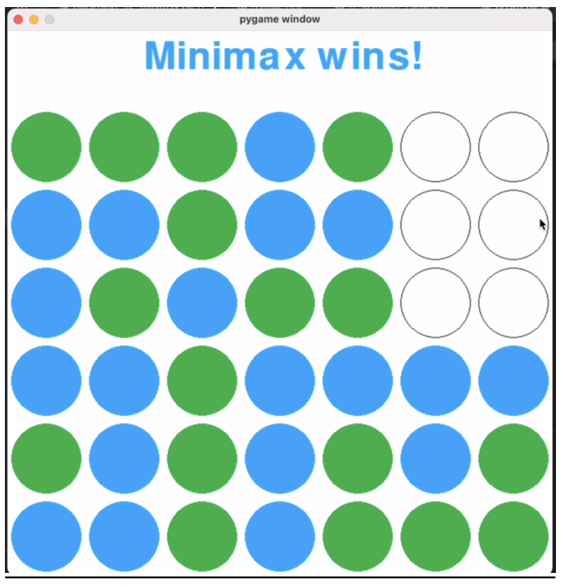

# AITicTacToeConnect4
This repository contains Python implementations of two classic games, Tic Tac Toe and Connect 4, as well as two reinforcement learning algorithms, Minimax with alpha-beta pruning and tabular Q-learning, that can learn to play these games. Also, the repository includes a default opponent that plays against the algorithms and can block winning moves.

### Tic-Tac-Toe

### Connect 4

# Experiment

### Games

1. Tic-Tac-Toe
Tic-Tac-Toe is a game for two players, where they take turns marking X’s and O’s on a 3x3 grid. The grid has 9 total states, and the goal is to get three of your marks in a row, either horizontally, vertically, or diagonally, before the other player does. The game is said to be draw if the grid is filled without a winner.

2. Connect 4
Connect4 is a game for two players, where they take turns putting colored discs into a grid of vertical spaces. The grid has a total of 42 states (7 columns and 6 rows), and the objective is to link four discs of your color horizontally, vertically, or diagonally before the other player does. The game is said to be draw if the grid is filled without a winner.

The two players in these games are played by the above-mentioned algorithms (Minimax, Q-Learning and Default Opponent) with each other and the performance is evaluated accordingly.

### Performance Metrics

The performance of the algorithms is measured using the following metrics:

- Win Rate – A number of games are played between agents of different algorithms, the outcome of each game is noted i.e., win, lose or draw. These numbers will be useful to estimate the accuracy of the algorithms in predicting and responding to different game scenarios.
- Execution Time - A number of games are played between agents of different algorithms. The execution time of each game is noted. This metric will be useful to gauge the efficiency of the algorithm for further optimizations.

### Design Choices

#### Q – Learning

Below highlighted values were chosen for the hyperparameters of Q- Leaning algorithm considering the Tic-Tac-Toe is a game consisting a total of 9 states and Connect 4 is a game consisting a total of 42 states.

1. Epsilon Value: It is used to maintain the balance of exploration and exploitation - Tic-Tac-Toe & Connect 4

Epsilon Value = 0.3 which means that there is a 30% probability that the agent will randomly explore a new action (randomly select an available move) instead of selecting the action with the highest Q-value. The remaining 70% of the time, the agent will exploit its current knowledge and select the action with the highest Q-value.

2. Alpha Value: It is known as learning rate is a hyper parameter in reinforcement learning which regulates the updated Q value for a particular state-action pair during learning.

- Tic-Tac-Toe

Alpha Value = 0.2 which indicates that the chances of selecting a random action are 20% and the chances of selecting the best action based on the learnt Q-values are 80%, respectively.

- Connect 4

Alpha Value = 0.5 which indicates that the chances of selecting a random action are 50% and the chances of selecting the best action based on the learnt Q-values are 50%, respectively.

3. Gamma Value: It is also known as the discounting factor which is used to balance the importance of immediate and future rewards.

- Tic-Tac-Toe & Connect 4

Gamma Value = 0.9 which indicates that the algorithm will 90% of the time choose a move at random (exploration) throughout each phase of the learning process and 10% of the time choose the move that maximizes its expected reward (exploitation).

4. Games Trained: The count of number of games trained in order to store and update the rewards for each possible action for each possible state which is then used to play against a selected opponent.

- Tic-Tac-Toe

Games Trained = 200,000, this number was chosen as it an optimal value in order to
balance the computation time as well as the accuracy of the algorithm

- Connect 4

Games Trained = 22700, more number of games must be trained for Q – Learning algorithm in order to increase the accuracy especially in a game like Connect 4 which consists of 42 states.

### Rewards

In Q-learning, the reward acts as the main feedback mechanism to direct the algorithm's learning process in the direction of the best course of action. For both games, a positive reward (+1) is given if a game is won and a negative reward (-1) is given if the game is lost. For Tic-Tac-Toe, a reward of 0 is given if the game ends in a draw state, while for Connect 4, a reward of 1/42 (0.02) is given if the game ends in a draw state. Additionally, for Connect 4, a small positive reward is given when the game ends in a draw to incentivize the Q-agent to end the game as quickly as possible.

### Results Comparison

#### Overall Performance Metrics with Default Opponent

The table below shows the performance metrics (Win Rate, Draw Rate, and Execution Time in milliseconds) for both algorithms when played against a default opponent in Tic-Tac-Toe and Connect 4.

| Algorithms                   | Minimax vs. Default Opponent | Q-Learning vs. Default Opponent |
|------------------------------|------------------------------|--------------------------------|
| Games                        | Tic-Tac-Toe, Connect 4       | Tic-Tac-Toe, Connect 4          |
| Win Rate                     | 81, 45                       | 84, 10                         |
| Draw Rate                    | 19, 0                        | 0, 5                           |
| Execution Time (ms)          | 163, 772                     | 0.266, 0.977                   |

Analyzing the values for Tic-Tac-Toe, it is clear that the Minimax algorithm is a better choice as this game contains comparatively a smaller number of states (9) than Connect 4 (42), and the game tree is small enough to be fully explored. For Connect 4, Minimax is partially successful and is not suitable for this game as it contains a greater number of states (42) due to which the Minimax algorithm may not be able to fully explore the game states and choices. Q-learning, on the other hand, performed poorly for Connect 4, this might be due to lack of sufficient training of the games. With a good amount of training, Q-learning could be a better algorithm for Connect 4 since the number of states and complexity is more when compared to Tic-Tac-Toe.

#### Overall Performance Metrics with Each Other

The table below shows the performance metrics (Win Rate, Draw Rate, and Execution Time in milliseconds) for both algorithms when played against each other in Tic-Tac-Toe and Connect 4.

| Algorithms  | Minimax   | Q-Learning |
|-------------|-----------|------------|
| Games       | Tic-Tac-Toe, Connect 4 | Tic-Tac-Toe, Connect 4 |
| Win Rate    | 70, 64   | 20, 28    |
| Draw Rate   | 10, 8    | 10, 8    |
| Execution Time (ms) | 162, 930 | 0.22, 0.30 |

Analyzing the values for Tic-Tac-Toe, it is clear that the Minimax algorithm is a better choice as this game contains comparatively a smaller number of states (9), and the game tree is small enough to be fully explored. For Connect 4, Minimax is mostly successful but is not exactly suitable for this game as it contains a greater number of states (42) and the Minimax algorithm could not be further trained in order to increase accuracy. Due to this, the Minimax algorithm may not be able to

## How to Run

### Step 1
Unzip the AI_Assignment_2.zip

### Step 2
Open the unzipped folder and launch Terminal/Powershell inside the folder and navigate to /code folder

### Step 3
Install the requirements by installing the packages in requirement.txt file using the below command

`pip install -r requirements.txt`

### Step 4
After installation of all the packages, open your python interpreter by using the command below

`python`

Note: if the above command for launching python interpreter does not work, please check your python version or try 'py' or 'python3'

### Step 5
#### Tic Tac Toe

To launch Tic-Tac-Toe game, import the ttt.py file by using the below command

`import ttt`

Tic Tac Toe game can be run in following three scenarios, run the respective commands

To Run Tic Tac Toe with Player 1 - Minimax and Player 2 - Default Opponent  

`ttt.minimax_vs_default(1)`

To Run Tic Tac Toe with Player 1 - Q Learning and Player 2 - Default Opponent 

`ttt.qlearning_vs_default(5,10000)`

To Run Tic Tac Toe with Player 1 - Minimax and Player 2 - Q Learning 

`ttt.minimax_vs_qlearning(5,10000)`

Note: The first argument in all the above mentioned methods specifies the number of games you want the player to play. The second argument in ttt.qlearning_vs_default() and ttt.minimax_vs_qlearning() is the number of games you want the Q Learning algorithm to be trained. Please note that you need to repeat the procedure from Step - 4 after execution of each method to run another method.

#### Connect 4
To launch Connect4 game, import the connect4.py file by using the below command

`import connect4`

Connect4 game can be run in following three scenarios, run the respective commands

To Run Connect 4 with Player 1 - Minimax and Player 2 - Default Opponent  

`connect4.minimax_vs_default(1)`

To Run Connect 4 with Player 1 - Q Learning and Player 2 - Default Opponent 

`connect4.qlearning_vs_default(1)`

To Run Connect 4 with Player 1 - Minimax and Player 2 - Q Learning 

`connect4.minimax_vs_qlearning(1)`

Note: The first argument in all the above mentioned methods specifies the number of games you want the player to play. Please note that you need to repeat the procedure from Step - 4 after execution of each method to run another method.

